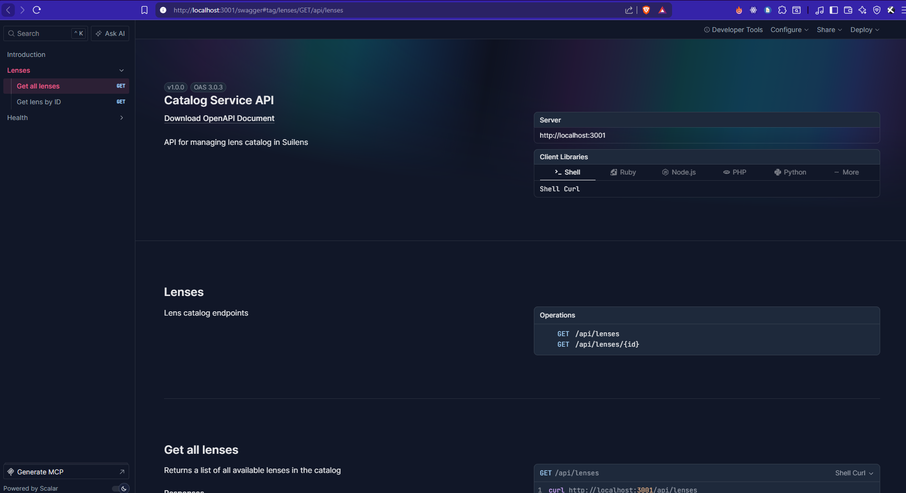
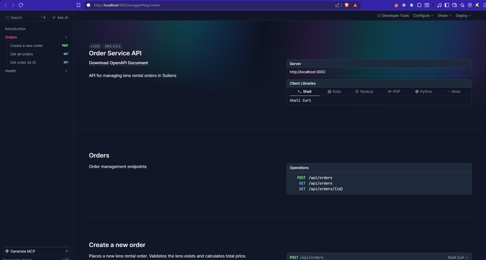
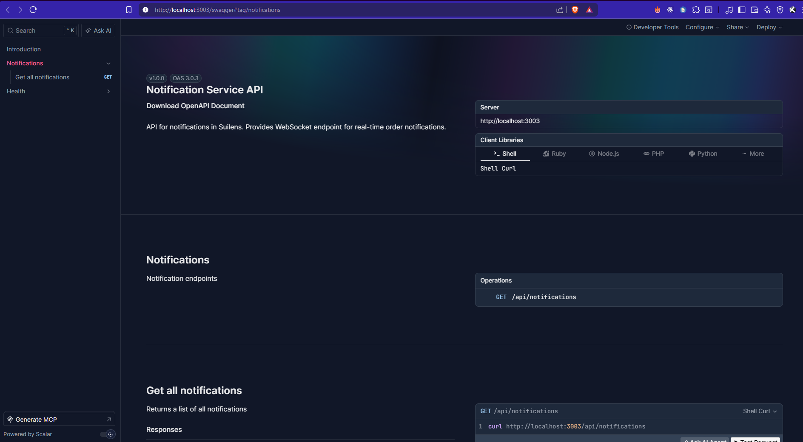
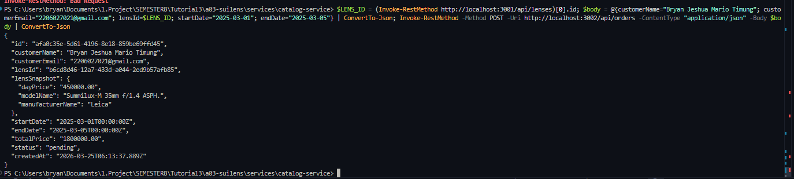
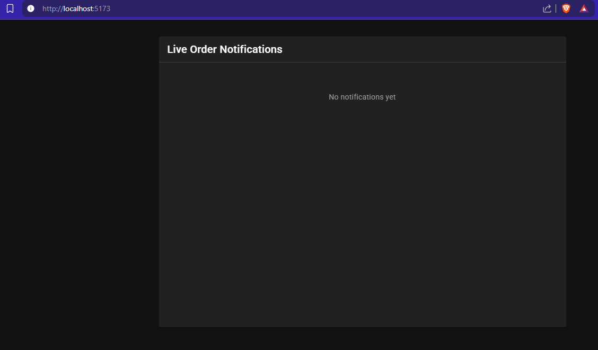
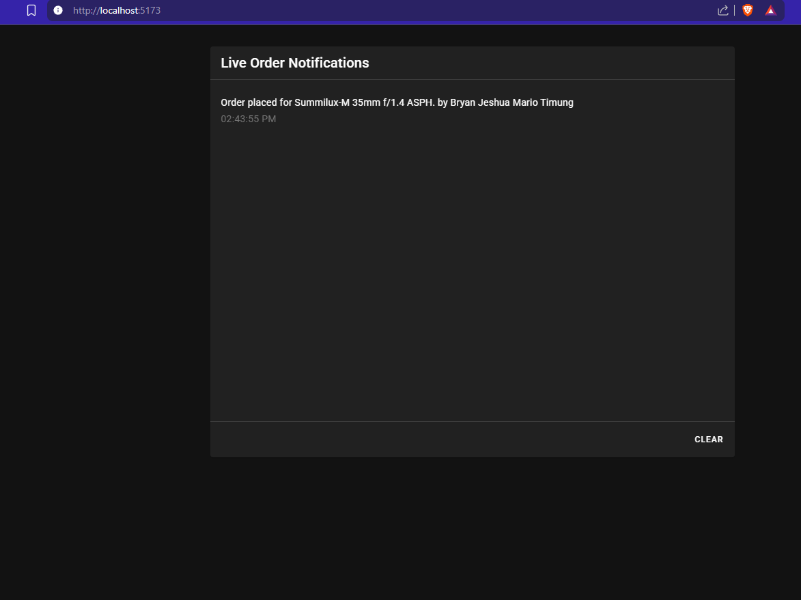
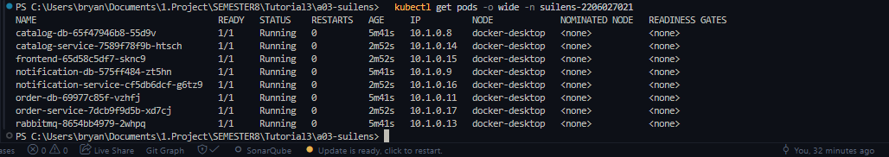

# suilens-microservice-tutorial

Microservices tutorial implementation for Assignment A03.

**Name:** Bryan Jeshua Mario Timung
**NPM:** 2206027021

## Tutorial can be seen on this [link](Tutorial_OnPremise_2206027021_BryanJeshuaMarioTimung.pdf)
## Run

```bash
docker compose up --build -d
```

## Migrate + Seed (from host)

```bash
(cd services/catalog-service && bun install --frozen-lockfile && bunx drizzle-kit push)
(cd services/order-service && bun install --frozen-lockfile && bunx drizzle-kit push)
(cd services/notification-service && bun install --frozen-lockfile && bunx drizzle-kit push)
(cd services/catalog-service && bun run src/db/seed.ts)
```

## OpenAPI Documentation

Each service exposes interactive API documentation via Swagger/Scalar:

- **Catalog Service:** http://localhost:3001/swagger
- **Order Service:** http://localhost:3002/swagger
- **Notification Service:** http://localhost:3003/swagger

### Catalog Service OpenAPI


### Order Service OpenAPI


### Notification Service OpenAPI


## Smoke Test

```powershell
$LENS_ID = (Invoke-RestMethod http://localhost:3001/api/lenses)[0].id; $body = @{customerName="Bryan Jeshua Mario Timung"; customerEmail="2206027021@gmail.com"; lensId=$LENS_ID; startDate="2025-03-01"; endDate="2025-03-05"} | ConvertTo-Json; Invoke-RestMethod -Method POST -Uri http://localhost:3002/api/orders -ContentType "application/json" -Body $body | ConvertTo-Json
```



## WebSocket

The notification service exposes a WebSocket endpoint at `ws://localhost:3003/ws`. The frontend automatically connects and displays real-time order notifications when new orders are placed.
Before smoke test

After smoke test


## Kubernetes Deployment

### Deploy to cluster

```bash
kubectl apply -f k8s/namespace.yaml
kubectl apply -f k8s/ -n suilens-2206027021
```

### Verify pods

```bash
kubectl get pods -o wide -n suilens-2206027021
```

### kubectl get pods -o wide



## Stop

```bash
docker compose down
```


## Link to Docker Swagger
- https://hub.docker.com/r/bryanjeshua/catalog-service
- https://hub.docker.com/r/bryanjeshua/order-service
- https://hub.docker.com/r/bryanjeshua/notification-service
- https://hub.docker.com/r/bryanjeshua/frontend

## AI Usage Disclaimer

This project was developed with the assistance of Claude (Anthropic) as an AI pair programming tool. AI assistance was used for tasks including debugging, writing Kubernetes manifests, and improving implementation quality. All code has been created, reviewed, understood, and validated by the author. The overall architecture, design decisions, and final implementation remain the responsibility of Bryan Jeshua Mario Timung.